# 설스터디

제4회 2026 블레이버스 MVP 개발 해커톤 참가 아카이브입니다.

`설스터디`는 자체 콘텐츠를 기반으로 수능 국어·영어·수학 학습을 코칭하는 플랫폼을 주제로, 고등학생 4인 팀 `일했음고딩`이 해커톤에서 기획·구현한 결과물입니다.

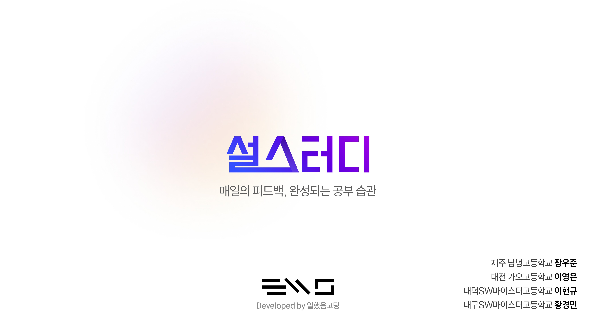

## 개요

- 대회: 제4회 2026 블레이버스 MVP 개발 해커톤
- 프로젝트명: 설스터디
- 한 줄 소개: 매일의 피드백으로 공부 습관을 만드는 학습 코칭 플랫폼
- 팀 구성: 고등학생 4인
- 보관 목적: 당시 발표 자료와 프로젝트 기록 아카이브

## 문제 인식

- 기존 일정 관리 도구는 단순 일정 기록에는 유용하지만 반복 학습 관리에는 한계가 있었습니다.
- 멘티는 모바일 환경에서 피드백 확인이 불편했고, 멘토는 피드백 품질을 일관되게 유지하기 어려웠습니다.
- 팀은 이를 바탕으로 학습 관리와 멘토링 운영을 함께 다루는 서비스를 만들고자 했습니다.

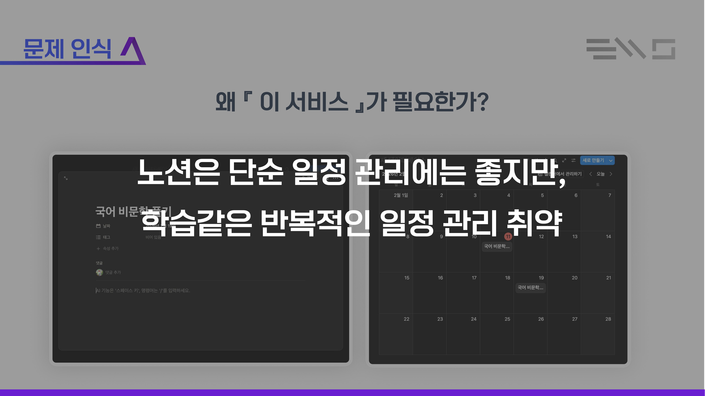

## 프로젝트 방향

- 멘토-멘티 구조를 중심으로 과제, 피드백, 학습지 관리를 통합
- 반복 과제 생성으로 학습 습관 형성 지원
- PWA 방식으로 다양한 기기에서 설치 가능하도록 구성
- 멘토 피드백을 정리하는 AI 보조 기능 실험

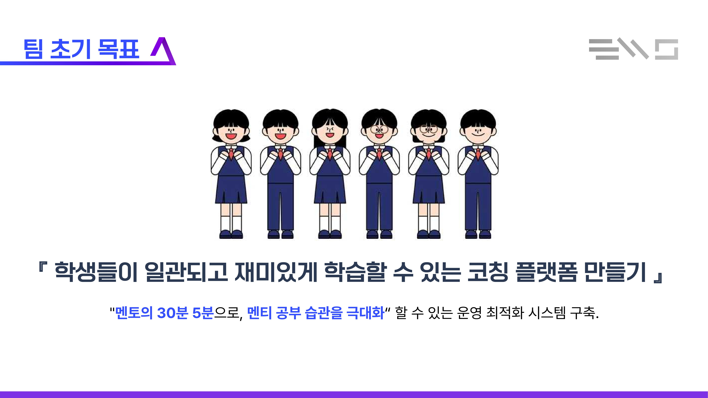

## 주요 화면 및 기능

### 1. 관리자 페이지

- 사용자 관리
- 멘토-멘티 매칭 관리
- 학습지 라이브러리 관리

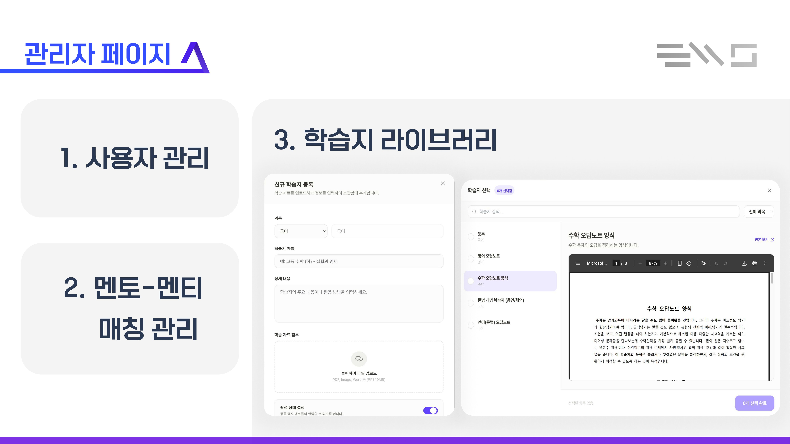

### 2. 멘토 페이지

- 멘티별 학습 플래너 확인
- 과제 배정 및 일정 관리
- 반복 과제 생성

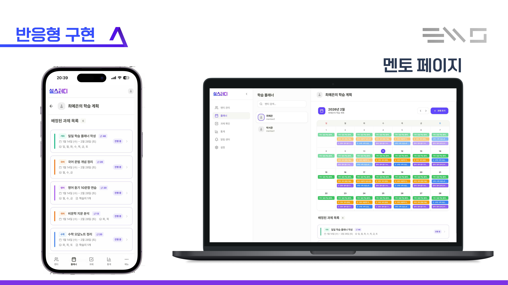

### 3. 멘티 페이지

- 오늘의 할 일 확인
- 미확인 피드백 확인
- 모바일 환경 중심 학습 동선 제공

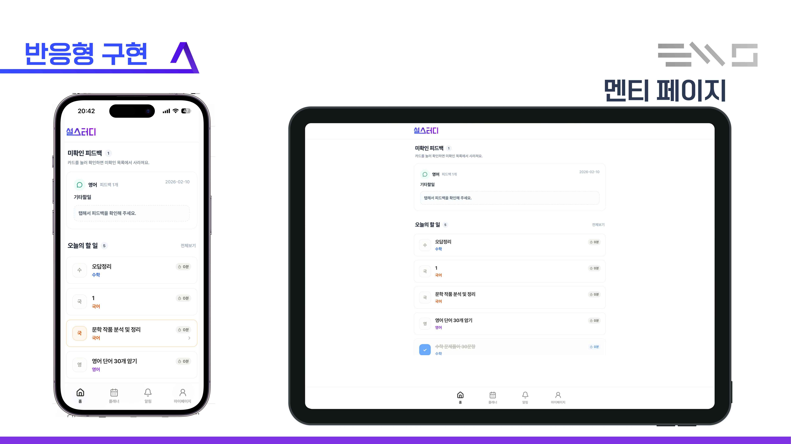

### 4. AI 다듬기

- 멘토별로 달라질 수 있는 피드백 문장을 보정
- 서비스 내 톤앤매너를 일정하게 유지하려는 시도

| 적용 전 | 적용 후 |
| --- | --- |
| 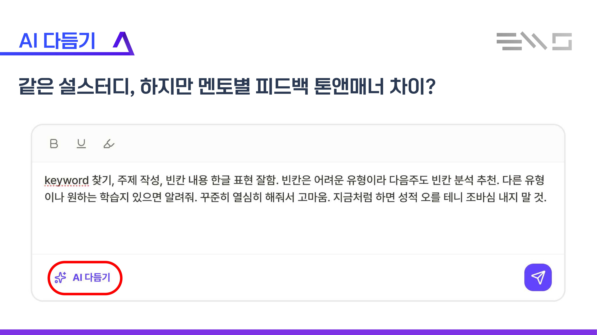 | 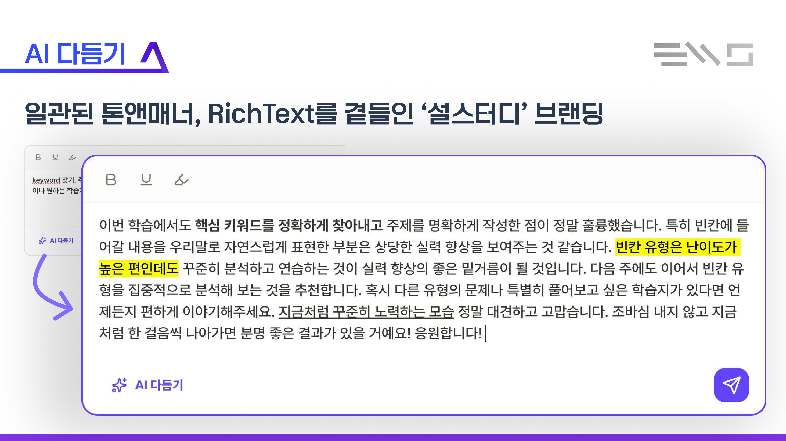 |

### 5. PWA

- 웹 기반으로 제작하되 앱처럼 설치 가능하도록 구성
- 모바일, 태블릿, PC 환경을 함께 고려

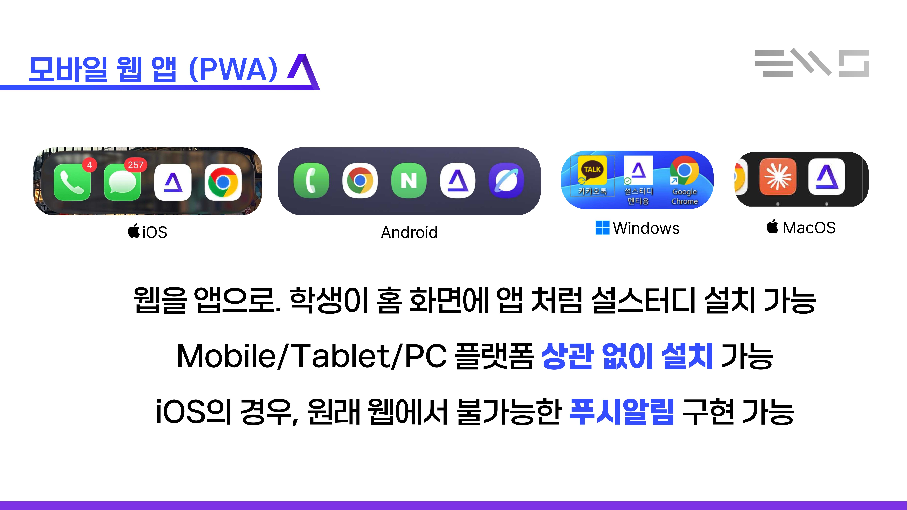

### 6. 반복 과제 생성

- 요일 기반 반복 과제 생성
- 아직 진행되지 않은 과제 일괄 수정 방식 반영

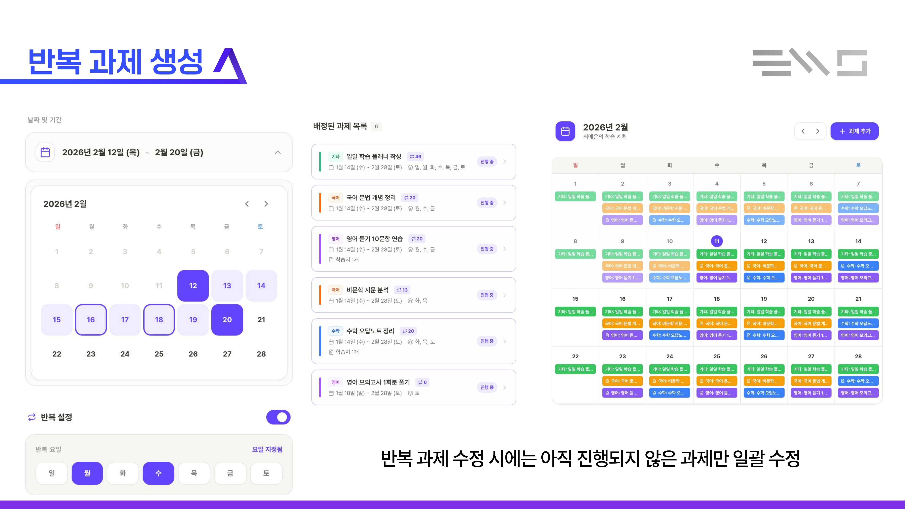

## 팀

- 장우준([@jundev76](https://github.com/jundev76)) — 팀장, BE/FE
- 이현규([@lhyunkyu](https://github.com/lhyunkyu)) — 멘토 FE
- 황경민([@ghkdrudals](https://github.com/ghkdrudals)) — 멘티 FE
- 이영은 — 프로젝트 전반 관리

## 향후 계획 및 회고

- 멘토링 데이터를 누적해 더 높은 품질의 자동화 피드백 구조로 확장하는 방향을 검토했습니다.
- 실제 네이티브 앱 확장과 사용자 피드백 반영도 후속 과제로 남겼습니다.
- 짧은 해커톤 일정 안에서 학습 습관 관리와 멘토링 운영을 함께 다루는 구조를 빠르게 정리해본 프로젝트였습니다.

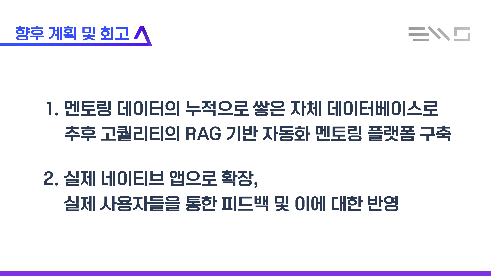
